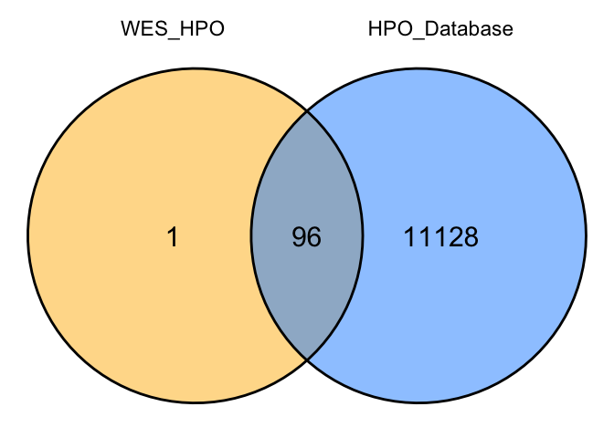

HPO table for Positive WES cohort
================

- <a href="#introduction" id="toc-introduction">Introduction</a>
- <a href="#hpo-table" id="toc-hpo-table">HPO table</a>
  - <a href="#change-mistakes-in-the-file"
    id="toc-change-mistakes-in-the-file">Change mistakes in the file</a>
  - <a href="#verify-that-all-hpo-terms-we-have-are-in-hpo-database"
    id="toc-verify-that-all-hpo-terms-we-have-are-in-hpo-database">Verify
    that all HPO terms we have are in HPO database</a>

Load libraries

``` r
library(xlsx)
library(dplyr)
library(tidyverse)
library(ggvenn)
```

# Introduction

As a reminder, we have a cohort of 28 patients on wich
Whole-Exome-Sequencing (WES) has been performed. For all, the
responsible variant has been identified. <br> So, we have in total, 28
vcf files from different plateforms.

# HPO table

Each patient has HPO (Human Phenotype Ontology) terms that describe its
phenotype and symptoms. In order to use it, we have to be sure that they
are all describe in the same way. HPO terms have an id and a name. The
id is like “HP:XXXXXXX”, it is composed by HP: following by seven
numbers and the name describe the symptoms or the phenotype of the HPO.

The HPO table have been made by Samira from genetic team of CHU de Nice.

``` r
# Load HPO table
wes_pos_annot <- read.xlsx("/Users/justine_labory/Downloads/WES Exomes_positifs pr Viola-v2.xls", header = T, sheetIndex = 1)
```

The HPO table is an excel file composed of several columns. - Column 1:
patient code defined by Samira<br> - Column 2: patient id defined by
Justine (corresponding to names of the files)<br> - Column 3: raw names
of vcf files<br> - Column 4: responsible genes<br> - Column 5:
responsible variants<br> - Column 6: clinic of the patient<br> - From
Column 7 to Column 21: HPO terms of the patient (one by column with
normally the following pattern HPO_id-back_to_line-HPO_name)<br>

Each patient have a different number of HPO terms, we have columns in
which we can have NAs.

``` r
# Rename columns in which there are HPO terms
names(wes_pos_annot) [7:21] <- paste0("HPO", seq(1,15))

# Delete empty columns
wes_pos_annot <- wes_pos_annot[,-c(22:32)]

wes_pos_annot <- wes_pos_annot %>%
  # keep columns that we need
  select(-c(1,3:6)) %>%
  # modify the format of the dataframe (from wider to longer) in order to have in a same column HPO terms
  # since we have different number of HPO terms according the patient, we remove NA.
  pivot_longer(cols=-patient_id, names_to="HPO", values_to = "hpo_id", values_drop_na = T)
```

## Change mistakes in the file

Normally, HPO terms column should look like HP:XXXXXXX. But sometimes,
we have the name of the HPO term before the HPO id, or the back to the
line can be missing, or sometimes we have only the HPO name without the
id.

``` r
# List all rows that contain errors in HPO term
wes_pos_annot[c(5,7,15,17,21, 25, 50, 52, 57, 60, 75, 91, 96, 97, 99, 104, 105, 111, 118, 120, 122, 123, 125, 126, 128:130, 133, 134, 137, 142, 150, 151,158, 159, 161, 163, 182, 183, 188, 190, 192, 197, 206),]
```

    ## # A tibble: 44 × 3
    ##    patient_id HPO   hpo_id                                                      
    ##    <chr>      <chr> <chr>                                                       
    ##  1 01-WES     HPO5  "Hypotonia HP:0001252"                                      
    ##  2 01-WES     HPO7  "Hypertonia HP:0001276"                                     
    ##  3 02-WES     HPO6  "HP:0001252 Hypotonia "                                     
    ##  4 02-WES     HPO8  "Hypertonia HP:0001276"                                     
    ##  5 03-WES     HPO2  "HP:0002014 Diarrhea"                                       
    ##  6 03-WES     HPO6  "Renal tubular dysfunction HP:0000124"                      
    ##  7 07-WES     HPO3  "Encephalopathy HP:0001298"                                 
    ##  8 07-WES     HPO5  "Epileptic encephalopathy HP:0200134"                       
    ##  9 07-WES     HPO10 "Abnormal circulating enzyme concentration or activity HP:0…
    ## 10 07-WES     HPO13 "Reduced visual acuity HP:0007663"                          
    ## # ℹ 34 more rows

``` r
# Modify all erros made in the file
wes_pos_annot$hpo_id[5] <- "HP:0001252\nHypotonia"
wes_pos_annot$hpo_id[7] <- "HP:0001276\nHypertonia"
wes_pos_annot$hpo_id[15] <- "HP:0001252\nHypotonia"
wes_pos_annot$hpo_id[17] <- "HP:0001276\nHypertonia"
wes_pos_annot$hpo_id[21] <- "HP:0002014\nDiarrhea"
wes_pos_annot$hpo_id[25] <- "HP:0000083\nRenal tubular dysfunction"
wes_pos_annot$hpo_id[50] <- "HP:0001298\nEncephalopathy"
wes_pos_annot$hpo_id[52] <- "HP:0200134\nEpileptic encephalopathy"
wes_pos_annot$hpo_id[57] <- "HP:0012379\nAbnormal circulating enzyme concentration or activity"
wes_pos_annot$hpo_id[60] <- "HP:0007663\nReduced visual acuity"
wes_pos_annot$hpo_id[75] <- "HP:0002060\nAbnormal cerebral morphology"
wes_pos_annot$hpo_id[91] <- "HP:0002060\nAbnormal cerebral morphology"
wes_pos_annot$hpo_id[96] <- "HP:0001249\nIntellectual disability"
wes_pos_annot$hpo_id[97] <- "HP:0011446\nAbnormality of mental function"
wes_pos_annot$hpo_id[99] <- "HP:0000708\nBehavioral abnormality"
wes_pos_annot$hpo_id[104] <- "HP:0001249\nIntellectual disability"
wes_pos_annot$hpo_id[105] <- "HP:0000708\nBehavioral abnormality"
wes_pos_annot$hpo_id[111] <- "HP:0012758\nNeurodevelopmental delay"
wes_pos_annot$hpo_id[118] <- "HP:0001249\nIntellectual disability"
wes_pos_annot$hpo_id[120] <- "HP:0012638\nAbnormal nervous system physiology"
wes_pos_annot$hpo_id[122] <- "HP:0011923\nDecreased activity of mitochondrial complex I"
wes_pos_annot$hpo_id[123] <- "HP:0008972\nDecreased activity of mitochondrial respiratory chain"
wes_pos_annot$hpo_id[125] <- "HP:0002015\nDysphagia"
wes_pos_annot$hpo_id[126] <- "HP:0002194\nDelayed gross motor development"
wes_pos_annot$hpo_id[128] <- "HP:0003577\nCongenital onset"
wes_pos_annot$hpo_id[129] <- "HP:0003593\nInfantile onset"
wes_pos_annot$hpo_id[130] <- "HP:0003128\nLactic acidosis"
wes_pos_annot$hpo_id[133] <- "HP:0012751\nAbnormal basal ganglia MRI signal intensity"
wes_pos_annot$hpo_id[134] <- "HP:0008972\nDecreased activity of mitochondrial respiratory chain"
wes_pos_annot$hpo_id[137] <- "HP:0007256\nAbnormal pyramidal sign"
wes_pos_annot$hpo_id[142] <- "HP:0008972\nDecreased activity of mitochondrial respiratory chain"
wes_pos_annot$hpo_id[150] <- "HP:0003693\nDistal amyotrophy"
wes_pos_annot$hpo_id[151] <- "HP:0008972\nDecreased activity of mitochondrial respiratory chain"
wes_pos_annot$hpo_id[158] <- "HP:0002019\nConstipation"
wes_pos_annot$hpo_id[159] <- "HP:0002014\nDiarrhea"
wes_pos_annot$hpo_id[161] <- "HP:0011805\nAbnormal skeletal muscle morphology"
wes_pos_annot$hpo_id[163] <- "HP:0009830\nPeripheral neuropathy"
wes_pos_annot$hpo_id[182] <- "HP:0001508\nFailure to thrive"
wes_pos_annot$hpo_id[183] <- "HP:0001510\nGrowth delay"
wes_pos_annot$hpo_id[188] <- "HP:0008972\nDecreased activity of mitochondrial respiratory chain"
wes_pos_annot$hpo_id[190] <- "HP:0003577\nCongenital onset"
wes_pos_annot$hpo_id[192] <- "HP:0001511\nIntrauterine growth retardation"
wes_pos_annot$hpo_id[197] <- "HP:0003593\nInfantile onset"
wes_pos_annot$hpo_id[206] <- "HP:0011463\nChildhood onset"


wes_pos_annot <- wes_pos_annot %>%
  #remove HPO column
  select(-HPO) %>%
  # separate hpo_id column into 2 new columns, one for the HPO id and the other one for name.
  separate(hpo_id, into = c("hpo_id", "hpo_name"), sep = "\n")

#wes_pos_annot

# Save the output file
# write.csv(wes_pos_annot, "/Users/justine_labory/Desktop/These_ANR/positive_wes_hpo_table.csv", row.names = F)
```

## Verify that all HPO terms we have are in HPO database

``` r
wes_pos_annot <- read.csv("/Users/justine_labory/Desktop/These_ANR/positive_wes_hpo_table.csv")
phenotype2gene <- read.delim("/Users/justine_labory/Desktop/These_ANR/database/hpo/phenotype_to_genes.txt")

list_for_venn <- list('WES_HPO'= wes_pos_annot$hpo_id,'HPO_Database'=phenotype2gene$hpo_id) 


ggvenn(list_for_venn, fill_color = c("darkgoldenrod1","dodgerblue1"),text_size = 8, stroke_linetype=1, show_percentage = F)
```

<!-- -->

**Only one HPO term appears to not be in the dabase**

``` r
setdiff(wes_pos_annot$hpo_id, phenotype2gene$hpo_id)
```

    ## [1] "HP:0032795"

``` r
wes_pos_annot %>%
  filter(hpo_id == "HP:0032795")
```

    ##   patient_id     hpo_id                                    hpo_name
    ## 1     10-WES HP:0032795 Generalized myoclonic-tonic-clonic seizure

I searched on HPO database website, the HPO term *HP:0032795* is well
associated to *Generalized myoclonic-tonic-clonic seizure*. But when I
go on *HP:0032795*, there is no disease or genes association, that is
why, we don’t find the HPO term into *phenotype2gene* file. The
phenotype *HP:0032795* has no gene associated.
